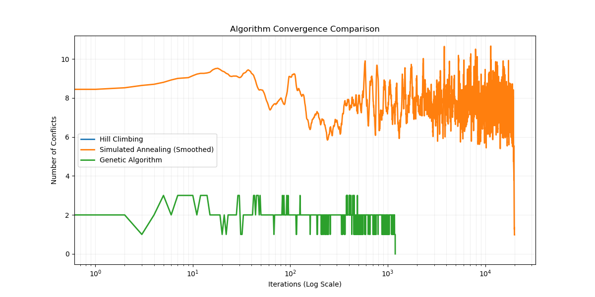

# N-Queens Local Search Analysis 

This project implements and compares three fundamental local search algorithms to solve the $N$-Queens problem.

## The Challenge
The $N$-Queens problem requires placing $N$ queens on an $N \times N$ chessboard such that no two queens threaten each other (no two queens share the same row, column, or diagonal). 

In this project, we represent the board as a **1D array** of length $N$, where the index represents the row and the value represents the column. This representation inherently solves the row conflict, reducing the search space and allowing the algorithms to focus on resolving column and diagonal threats.

---

##  Algorithm Exposition

### 1. Hill-Climbing (Greedy Local Search)
Hill-climbing is a loop that continually moves in the direction of increasing value (or decreasing cost). It is often called **greedy local search** because it grabs a good neighbor state without thinking ahead.

* **Strengths:** It often makes rapid progress toward a solution because it is usually quite easy to improve a bad state.
* **Weaknesses:** It is susceptible to **Local Maxima** (peaks higher than neighbors but lower than the global optimum), **Ridges**, and **Plateaux** (flat areas where the algorithm gets lost).
* **Implementation:** To overcome incompleteness, we implement **Random-Restart Hill Climbing**. It conducts a series of searches from randomly generated initial states until a goal is found. 

### 2. Simulated Annealing
Simulated Annealing combines hill-climbing with a random walk to achieve both efficiency and completeness. Inspired by the metallurgical process of tempering metal, it minimizes "cost" (conflicts) by "shaking" the system.

* **The Logic:** The algorithm picks a random move. If the move improves the situation, it is always accepted. Otherwise, it accepts the move with a probability that decreases over time as the **Temperature ($T$)** drops.
* **Implementation Note:** While the textbook suggests an exponential decay, this project utilizes **Linear Decay** ($T = T - \text{constant}$), as it was found to provide more stable convergence for the $N$-Queens state space.

### 3. Genetic Algorithms
A Genetic Algorithm (GA) is a variant of stochastic beam search that mimics biological evolution. It maintains a **population** of states rather than a single node.

* **Fitness Function:** Each state is rated by a fitness function (the inverse of conflicts).
* **Selection & Crossover:** Pairs are selected for reproduction based on fitness. A random **crossover point** is chosen, and offspring are created by combining the "DNA" of the parents.
* **Mutation:** Random mutations are introduced with a small probability to maintain diversity and explore new areas of the state space.

---

##  Results & Visualization

### Convergence Comparison
The following graph illustrates how the conflict count (Energy) drops over time across different strategies.

**

**Important Notes on the Graph:**
* **Hill-Climbing:** You will notice Hill-Climbing is not represented on the convergence line graph. Because it is a purely greedy algorithm, when a solution exists in its immediate vicinity, it converges the **quickest** of all algorithms. Its "history" is often only a few steps long, making it appear as a single dot on a log-scale graph designed to show the long-term exploration of SA and GA.
* **Simulated Annealing Smoothing:** The SA line is smoothed using a moving average to show the general trend of the cooling process, filtering out the high-frequency stochastic "jumps" used to escape local minima.

### Performance Summary (N = 8)

| Algorithm | Success Rate | Avg. Time | 
| :--- | :--- | :--- | :--- |
| **Hill-Climbing** | 12% (Eventual) | < 0.002s | 
| **Simulated Annealing** | ~100% | ~0.35s |
| **Genetic Algorithm** | ~96% | ~0.92s |

---

##  Setup and Usage
1. **Requirements:** `python 3.x`, `matplotlib`, `numpy`
2. **Run:** Execute `python
